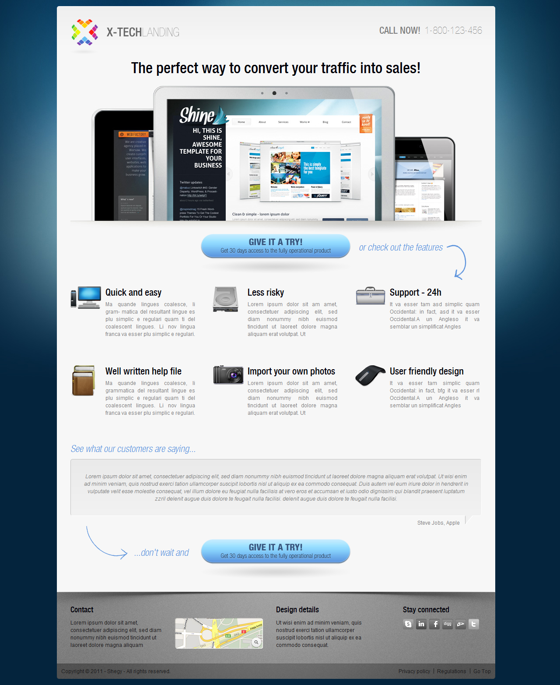

# X-TECH LANDING

Bài tập CSS nâng cao - Môn Phát triển ứng dụng Web



## Thông tin sinh viên

- Họ tên : Nguyễn Chánh Đại
- MSSV : 18120113
- Email : 18120113@student.hcmus.edu.vn

## Bảng điểm

| Nội dung                                                                                            | Điểm | Tự đánh giá |
|-----------------------------------------------------------------------------------------------------|:----:|:-----------:|
| Xây dựng giao diện                                                                                  |   4  |      4      |
| Sử dụng số lượng hình thích hợp                                                                     |   3  |      3      |
| Tương thích với 4 trình duyệt (phiên bản cao nhất) : Microsoft Edge, Google Chrome, Firefox, Safari |   2  |      2      |
| Đăng tải lên host thực tế (https://x-tech-lading.ncdai.name.vn)                                     |   1  |      1      |

## Development

```bash
yarn global add sass
sass --watch assets/scss/default.scss assets/css/default.css
```
